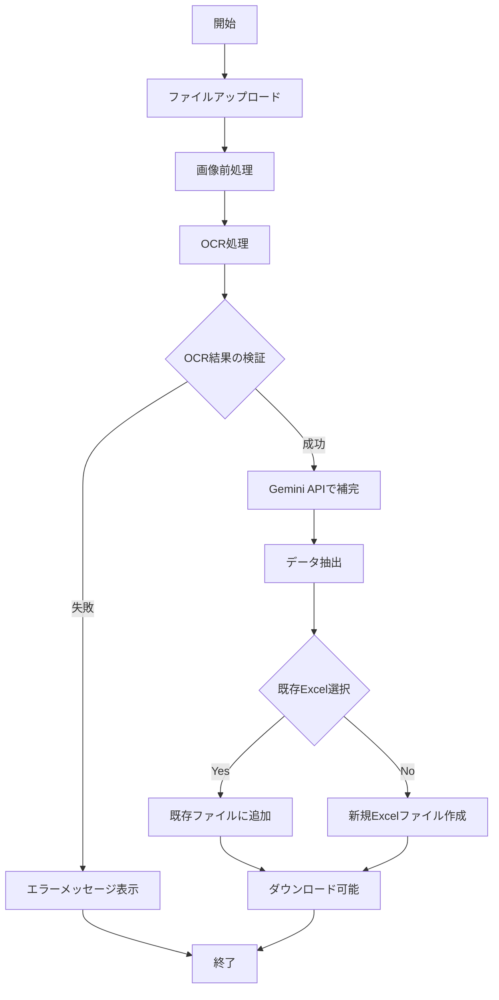

# 領収書OCRシステム フローチャート

## 処理の詳細

1. **ファイルアップロード**
   - 対応形式: PDF, JPG, JPEG, PNG
   - ファイルサイズ制限あり

2. **画像前処理**
   - ノイズ除去
   - 傾き補正
   - コントラスト強調
   - アダプティブ閾値処理
   - モルフォロジー演算

3. **OCR処理**
   - Tesseract OCRを使用
   - 信頼度スコアの計算
   - テキスト抽出

4. **Gemini API補完**
   - OCR結果が不十分な場合に使用
   - 構造化データの抽出
   - 信頼度に基づく結果選択

5. **データ抽出**
   - 発行日
   - 支払先名
   - 金額
   - インボイス番号

6. **Excel出力**
   - 新規作成または既存ファイルに追加
   - ID列の自動採番
   - 書式の統一（左寄せ）
   - 列幅の自動調整
